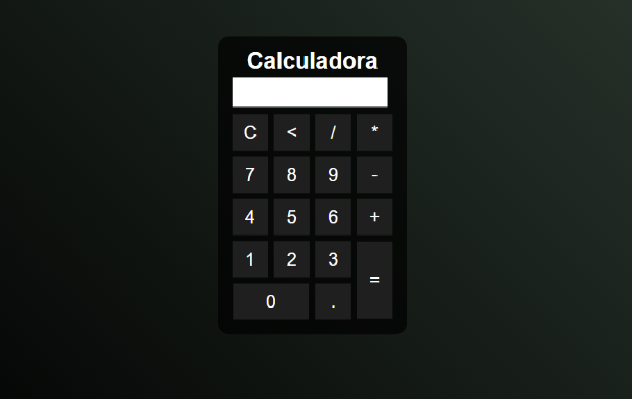

# 🧮 Calculadora

Este repositório contém uma calculadora simples desenvolvida utilizando HTML, CSS e JavaScript. A calculadora permite realizar operações básicas como adição, subtração, multiplicação e divisão.

### ✨ Funcionalidades

- **Operações Básicas:** Adição (+), Subtração (-), Multiplicação (*) e Divisão (/).
- **Limpar Tela:** Botão "C" para limpar o visor.
- **Calcular Resultado:** Botão "=" para exibir o resultado da operação.
- **Interface Responsiva:** Design simples e responsivo para uma boa experiência em diferentes dispositivos.

## 🚀 Tecnologias Utilizadas

- HTML5
- CSS3
- JavaScript

## 🛠️ Como Usar

Acesse a [versão online](https://geovanigaldino.github.io/calculadora/)
